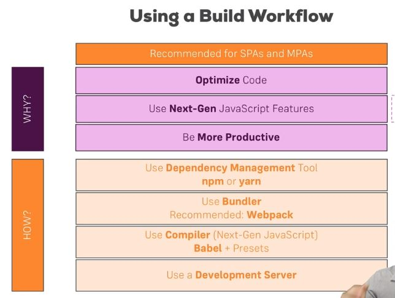

# 03. Understanding the Base Features & Syntax

## 1. Building Workflow


## 2. create-react-app (dependency)
website : https://create-react-app.dev/   
github : https://github.com/facebook/create-react-app


  - Download
  ```
  npm install create-react-app -g
  ```
  - React app 생성
  ```
  create-react-app app이름 --scripts-version 1.1.5

  (version 선택은 강의와 동일한 project structure 를 형성하기 위한 목적)
  ```
  - Dev version server 실행
  ```
  npm run start
  ```

## 3. Components & JSX ([>> pdf](./ref/compotnents_jsx_cheatsheet.pdf))
  - ### Components
   : React app 의 핵심 building block(구성요소)   
    => React app 은 **Component Tree** 라고도 불림   
    - 하나의 **root component** (보통 "App") 와 무한한 **child component** 들로 구성됨
  - ### Component 의 두 종류 및 생성 방법 [[예시>>](./react-complete-guide/public/Person.js)]
    #### 1. Functional components
      - 주로 쓰임
      - **presentational**, **dumb**, **stateless component** 라고도 불림
      - code :
        ```
        const cmp = () => { 
          return <div>some JSX</div> 
        }
        ```

    #### 2. Class-based components
      - **containers**(state 를 보유하고 있으므로), **smart**, **stateful component** 라고도 불림 (but. functional component 의 **Hook** 때문에 기준이 모호해짐)
      - code :
        ```
        class Cmp extends Component {
          render() {
            return <div>some JSX</div>
          }
        }
        ```

    #### 3. 또 다른 분류 방법
      > but. React 16.8 의 Hook 기능이 생긴 후로 state 여부로 functional 과 class-based 를 나누는 기준이 모호해짐 
      - **stateful component**
        - **state 를 다루는** component 를 말함
        - App 전체에 **하나 또는 둘** 정도만 가지는 것이 **유지 및 보수**에 좋음(규모에 따라 변동)
      - **stateless component**
        - **state 를 다루지 않는** component
        - App 에서 **더 많이 사용**해야할 component   
      

  - ### JSX 동적 입력 ({}, props, state)
    - #### { } 로 감싸주기 [>>]()
      - 한줄짜리 expression 만 사용 가능 
      - class 선언 및 조건문(if) 은 불가
      - function 호출은 가능
    - #### props 이용 [>>]()   
      - props(properties) : React 에서 제공하는 객체로 JSX 에서 입력한 atrribute 들을 담고 있음
      ```
       1. 선언 : {props.name}  / 사용 : <Person name="Max" age="28"/>
       2. {props.children}  : 해당 요소의 자식요소 전체를 가리킴
       ```
    - #### state 이용 [>>]()   
      - Component 객체를 상속(extends)하는 **class-based component** 내에서만 사용할 수 있는 내장 객체. 하지만, **React 16.8** 부터는 **function component** 에서도 사용 가능해짐 **(Hook)*****   
      - 보통 **상위 요소**에서 **하위 요소 reder** 시 **props 의 값 지정**해줄 때 사용

  - ### Props & State ([>> pdf](./ref/props_state.pdf))
    : React 의 **핵심 개념**   
    : <u>오직 **props** 또는 **state** 의 변화만이 React 의 **re-render** 를 동작시킬 수 있다.</u>   
      -> **DOM 변경** 가능 (자세한 내용은 **[section 6]()**)
    - #### Props   
      : Parent component 로부터 child component 에 **data 를 전달** 할 수 있게 해주는 **객체**
      - 객체의 이름은 아무렇게도 상관 없음
      - function component 에서 **하나의 객체**만 매개변수로 받을 수 있음
      - 예시:
      ```
      부모 요소 : Post component 에 title data 를 전달

      const posts = () => {
          return (
              <div>
                  <Post title="My first Post" />
              </div>
          );
      }


      자식 요소 : title data 를 전달 받아 comoponent 에 삽입

      const post = (props) => {
          return (
              <div>
                  <h1>{props.title}</h1>
              </div>
          );
      }
      ```
      
    - #### State   
      : component class 또는 function(react 16.8버전 이상) 내에서만 사용 가능한 객체   
        - naming 은 **반드시** **state** 로 해야함 _ 그래야만 re-render 동작 가능   
        - **class-based component** 에서 사용 시 **this.state** 로 호출 
        - <u>보통 **상위 요소**에서 **하위 요소 reder** 시 **props 의 값 지정**해줄 때 사용</u>
        - 예시
          ```
          class NewPost extends Component {
              state = {
                  counter: 1
              };  
          
              render () {
                  return (
                      <div>{this.state.counter}</div>
                  );
              }
          }
          ```

    - #### 차이점   
      - **props** 는 외부로부터 받은 data 에 의해 **re-render** 발생   
      - **state** 는 내부의 data 변화에 의해 **re-render** 발생

    - #### State 의 변화 
      ##### 1. Class-based Component 에서  [>> code]()
        - **this.setState( 매개변수: 변경된 state객체의 property )** 사용하여 변경   
        - **.setState** 는 React library 의 **Component 객체**의 **method** 임
        - state 에 있는 property 들 중 **수정된 것**만 **인식**하여    
          **기존 state** 와 **merge** 시킴    
          **=>** render 된 Browser 의 DOM 을 **scan** 하여 수정필요한 부분 **re-render** 함

      ##### 2. Functional Component 에서 : Hook ([>> useState 사용법]())     
        - React 16.8 버전부터 **use..** 으로 이름붙여진 **Hook** 들 제공함 (import 해서 사용)
        - HOOK 의 **장점** ([>> web 자료](https://ddwroom.tistory.com/75))
        - this.setState 와 달리 **변경되지 않은 Property** 와 **자동 merge** 시키지 않음   
        ==> state 내의 **각 property 별**로 **따로 Hook 을 선언**해준다.

  
  - ### Event
    - [>> event 종류](https://reactjs.org/docs/events.html#supported-events)
    - [>> code 예시]()

  - ### Style
    - inline styles
    - style sheets